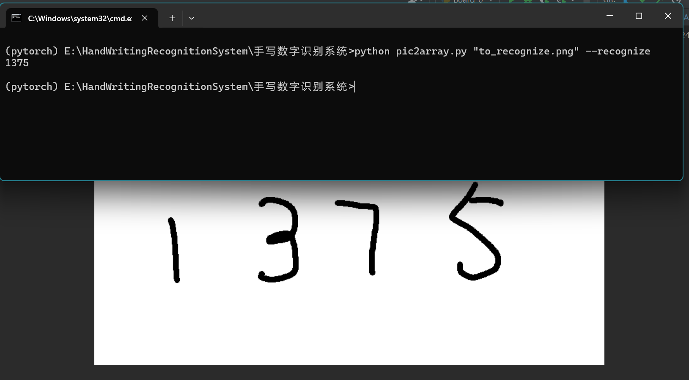

# 手写数字识别系统

## 项目简介
本项目为江苏大学数字图像处理课程（24Spring，教师：陈军、刘哲）的大作业。项目目标是实现一个手写数字识别系统，采用了五种机器学习算法，包括逻辑回归、支持向量机、随机森林、k最近邻以及朴素贝叶斯模型。

## 模型权重
- **逻辑回归**: 1.5
- **支持向量机**: 1.2
- **随机森林**: 1.5
- **K最近邻**: 1.0
- **朴素贝叶斯**: 1.0

## 环境配置
请确保您的环境中安装了以下Python包：
- `numpy`
- `pandas`
- `scikit-learn`
- `matplotlib`


## 文件结构
## 文件结构
- **Board_0.py**: 本地UI部署。
- **ensemble.py**: 各模型集成。
- **pic2array.py**: 图像处理脚本，实现图像到数组的转换、分割和归一化。该脚本现在支持命令行交互，可以接收图像文件路径作为输入，并根据命令行参数将图片分割成多个 `(28, 28)` 形状的二进制文件或进行图像识别。
    - 使用 `--recognize` 参数时，识别图片中的手写数字并返回结果。
    - 使用 `--segment` 参数时，将图片分割成指定格式的二进制文件，并返回生成文件的数量。
- **\*.ipynb**: 各模型的训练笔记本。
- **README.md**: 项目说明文档。

## 使用指南
请参阅项目中的 `.ipynb` 笔记本文件，其中包含了各模型的训练过程和详细的代码说明。每个笔记本都详细描述了数据处理、模型建立、训练及验证步骤。
### 命令行使用示例
1. **识别图片中的手写数字**
   ```bash
   python pic2array.py /path/to/image --recognize

输出识别的数字，如`12345`。
2. **将图片分割成二进制文件**
   ```bash
   python pic2array.py /path/to/image --segment
输出将显示生成的二进制文件数量。例如，如果输出为 5，则表示已成功创建 5 个二进制文件。

### 本地使用示例
在安装完必要的包后，直接运行Board_0.py

